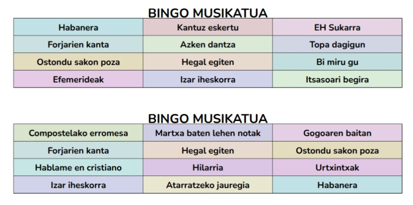
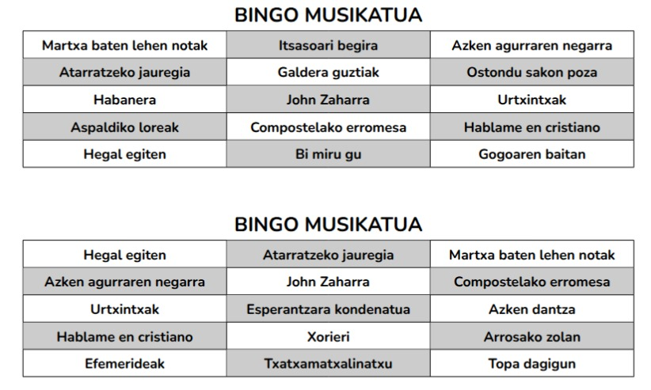

# BingoMusikatua - Bingo musikatuetarako kartoiak automatikoki sortzeko kodea!


Abesti-zerrenda baten fitxategia emanda, kartoiak latex-eko kodean idazten ditu, eta kode hori latex-eko konpilatzaile batean (Overleaf) itsastea besterik ez da behar.


## Nola erabili?

Lehenik eta behin, `python` erabilgarri izan behar da. Pythoneko scriptak erabiliko ditugu kartoien kodea sortzeko.

### Idatzi abesti zerrenda

Fitxategi honek nolakoa izan behar duen jakiteko, jo `fitxategiak/` karpetara; bi zerrenda ikusiko dituzu bertan, partida bakarrerako abestiak dituena, eta bi bingo partida egiteko abestiak dituena. Alde bakarra, bigarrenak `1` edo `2` zenbakiak dituela abestien izenaren aurretik.

### Sortu kodea

Bi modutan egin daiteke:

#### Interaktiboki, Notebook bidez

Modu hau erabiltzeko, ireki `BingoMusikatuaNotebook.ipynb` fitxategia. Notebook honetan pausoz pauso joango da urratsak azaltzen. Bertan ageri diren balioak alda ditzakezu zuk nahi duzunaren arabera: abesti kopurua, kartoi kopurua...

Bingo-saiorako zenbat abesti aukeratu ez badakizu, lehen zatiak lagun diezazuke: zure datuak sartuta, batez bestean partida zenbagarren abestian amaituko den estimatzen da. Abesti bakoitzari eman nahi diozun luzeraren arabera kalkulatu ahal izango duzu zure partidaren gutxi gorabeherako iraupena!

Bigarren zatian, zure datuak sartuta, zuzenean sortu ahal izango duzu latex-eko kodearen fitxategia.

#### Zuzenean terminaletik

Zuzenean terminaletik ere egin daiteke, pythoneko scripta exekutatuta. Horretarako, honako hau idatzi beharko duzu terminalean:

```bash

python KartoiakSortu.py -N <kartoi kopurua> -n <kartoiko abesti kopurua> -a <abesti-zerrendaren fitxategiaren izena>
```

Hutsune bakoitzean zure balioak ordezkatu beharko dituzu; honela:

```bash
python KartoiakSortu.py -N 20 -n 12 -a fitxategiak/zerrenda_adibidea_2partida.txt
```

Hor ageri diren balioak nahitaez sartu beharrekoak dira, baina badira beste batzuk aukerakoak direnak:
- `-o <latexeko fitxategiaren izena>` -> Irteerako fitxategiaren izena aukeratzeko. Bestela, defektuz: `latex_kodea.txt`
- `-i <kartoien izenburua>` -> Kartoien gainean ageriko den testua. Bestela, defektuz: "BINGO MUSIKATUA"
- `-k` -> Hau gehituz gero, kartoiak koloretan inprimatuko dira.

Adibidez: 
```bash
python KartoiakSortu.py -N 20 -n 12 -a fitxategiak/zerrenda_adibidea_2partida.txt -o "kode_osoa.tex" -i "Bazkaloste musikatua!" -k
```

### Konpilatu kodea

Egin behar den gauza bakarra sortutako fitxategiko kode osoa kopiatu eta latexeko konpilatzaile batean itsastea da. Era horretan kartoi guztiak biltzen dituen PDFa lortuko duzu.

Modurik errazena [Overleaf](https://www.overleaf.com/) plataforma erabiltzea da. Sortu kontua, hasi proiektu bat eta itsatsi kodea `.tex` fitxategi batean (sortu duzun fitxategia `.tex` erakoa bada, zuzenean igo dezakezu plataformara). Ondoren, konpilatu irudikatzeko, eta inprimatu.

Bi partidako bingoen kasuan, kartoiek tamaina bera izango dute, eta zehazki bata bestearen atzean inprimatzeko moduan dago pentsatuta. Beraz, bi aldetatik inprimatu ahal izango duzu PDFa, eta ez da arazorik egongo mozterako orduan. Partida bakarrerako bada, kontuz, alde bakarretik inprimatu beharko duzu PDFa!


## Adibideak, irudietan

Irudi hauetan ikus daiteke nolako itxura izango duten kartoiek, tamainaren eta koloreen arabera:

1. Koloretan, 12 abestiko kartoiak:


2. Zuri-beltzean, 15 abestiko kartoiak:



Abesti kopuruaren arabera, orrialdeko 4 edo 5 kartoi ageriko dira, automatikoki.