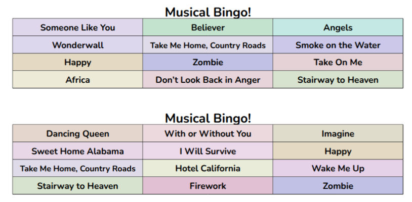
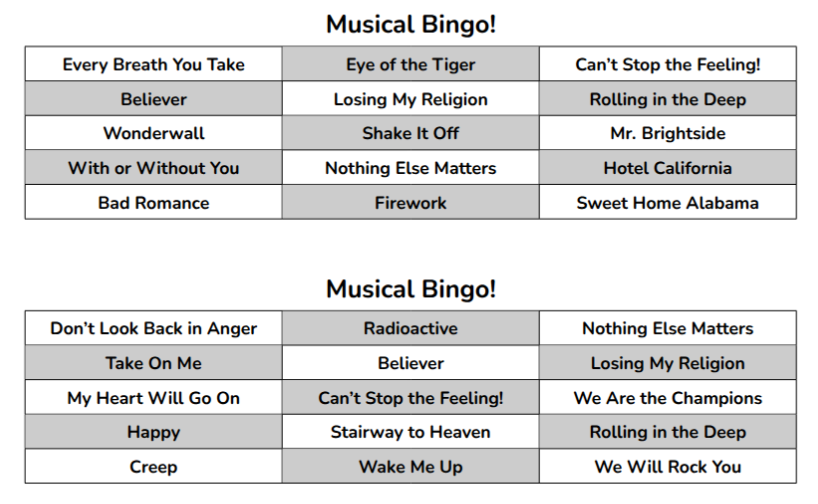

# MusicalBingo - Code to automatically generate cards for your Bingo games!

<p align="center">
  
</p>

This codes generates Bingo cards, but instead of using numbers, it uses song names.

Providing a list with song names, it generates Bingo cards in LaTeX code. This code can directly be compiled to obtain a PDF with all the needed cards to play a fun Bingo game! Keep reading to learn how to use it.


## How do I use it?

### Prerequisites
Necessary to have `python` available (optional `matplotlib` library, if you want to plot some images), as we will be running Python scripts to generate the cards.

### Create a list of songs

The list of songs needs to be stored in a file. To know how this file needs to look like, you can check the examples in `files/`. You can find two files there, one containing the file list to generate cards for a **single Bingo game** (`example_list_1game.txt`), and the other one to generate cards for **two consecutive Bingo games** (`example_list_2games.txt`). They have the same structure; the only difference is that if you want two games, you have to add the game index before the song name. The lengths of the games does not need to be the same: you can have a first game with 20 songs and a second one with 15.

If the name of a song is too long, it might not fit in a single line and will be written in two lines. In this case, it might cause problems, since the size of the tables and the organisation of the pages is not prepared for that. **How do I fix this?** In your song list file, at the end of the name of the song, you can add either `[s]`, to make the size smaller, or `[t]`, to make it tiny. You can see an example in `files/example_list_1game.txt`

### Generate the code

You can do it in two ways:

#### Interactively, using the Notebook

To use this method, open file `MusicalBingo.ipynb`. This notebook explains how to run the whole code step by step, using examples. You can change the parameters along the process, to create your desired Bingo game: number of song, number of players, song names, colours...

If you are not sure how many songs you should add to the list, the first part of the notebook could be of use: add your parameters, and the function will help you estimate the number of songs it will take for someone to do Bingo! Then you only need to multiple that value with the length of the songs (it does not have to be the whole song, it could be 30s, 60s...), and you will have an estimation of the length of your bingo game!

The second part of the notebook will help you generate the actual cards for the game, and you will obtain a file with the necessary LaTeX code to print all the cards. You will only need to print the generated PDF and cut the cards!

#### Directly, from the terminal

You can also run the Python script directly from the terminal. You just need to type this:

```bash
python CreateCards.py -N <total number of cards> -n <songs per card> -a <filename of list of songs>
```

Substitue your own values inside the <>:

```bash
python CreateCards.py -N 20 -n 12 -a files/example_list_1game.txt
```

These values necessarirly need to be provided; but there are additional parameters you can add, which are optional, so you can further personalise the cards:
- `-o <output filename for latex code>` -> Name of the output file containing the LaTeX code. Default value: `whole_latex_code.txt`
- `-i <title for cards>` -> Title that will appear on top of every card Default value: "MUSICAL BINGO". If there are more than one game, the game index will be added automatically.
- `-k` -> If this key is added, the cards will ben created with colour, a different colour for each song.

Example: 
```bash
python CreateCards.py -N 20 -n 12 -a files/example_list_1game.txt -o "my_latex_code.tex" -i "Musical Bingo!" -k
```

### Compile the code

Now you only need to compile the code stored in the output filename using a LaTeX compiler. You will directly obtain a PDF containing all the cards for your game.

The recommended way is using the [Overleaf](https://www.overleaf.com/) platform. Create an account if you don't have one, make a new project and paste the code in a `.tex` file (or upload your own `.tex` file). Then, compile the code and print the PDF.

In the cases where you have two Bingo games, the cards of each game will be printed in each face of the file: first game in the fron face, second game in the back. It's calculated so they perfectly match one card behind the other, so you do not have to worry when cutting them. You only need to print the cards from both faces of the page. If you are only playing one game, you need to leave the back of the page blank!


## Examples, with images

These images show how the cards will look, depending on their size and colour:

1. In colour, with cards of 12 songs each (5 cards per page will be printed):
```bash
python CreateCards.py -N 2 -n 12 -a files/example_list_1game.txt -i "Musical Bingo!" -k
```



2. In black and white, with cards of 15 songs each (4 cards per page will be printed, since they are bigger):
```bash
python CreateCards.py -N 2 -n 15 -a files/example_list_1game.txt -i "Musical Bingo!!!!!"
```


Depending on the number of songs per card, 4 or 5 cards will be printed per page. This is selected automatically.